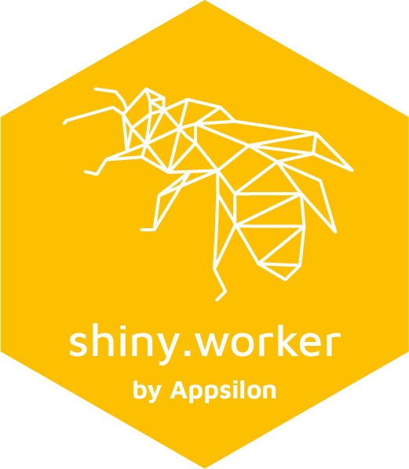

<a href = "https://appsilon.com/careers/" target="_blank"></a>

<a href='https://github.com/Appsilon/shiny.worker'></a>

# shiny.worker

`shiny.worker` allows you to delegate heavy computation tasks to a separate process,
such that it does not freeze your Shiny app.

## How to install?

Pick the stable version from CRAN:

```r
install.packages("shiny.worker")
```

or the latest from GitHub:

```r
remotes::install_github("Appsilon/shiny.worker")
```

## Example

See live example [here](https://demo.appsilon.ai/apps/shiny-worker/) or more examples with code in the `examples/` folder.

### How to use it?

Initialise your worker at the beggining of your app.

```r
worker <- initialize_worker()
```

Then, in the server of your Shiny app define a promise that returns a reactive when your heavy job will be completed.

```r

my_heavy_calculations <- function(args) {
  # ...
  args
}

# this reactive object is used to trigger the job start,
# but also to pass parameters to the function
reactive_arguments <- reactive({ 
  input$start
  list(r = rnorm(1))
})

# resultPromise will be a reactive value with results returned by my_heavy_calculations
resultPromise <- worker$run_job("job1", my_heavy_calculations, args_reactive = reactive_arguments)

resultPromise()$result # contains the result of the calculations
resultPromise()$resolved # contains flag that informs whether the job has finished or not
```

## Appsilon


Appsilon is the **Full Service Certified RStudio Partner**. Learn more
at: [appsilon.com](https://appsilon.com) or get in touch: `support+opensource@appsilon.com`.
